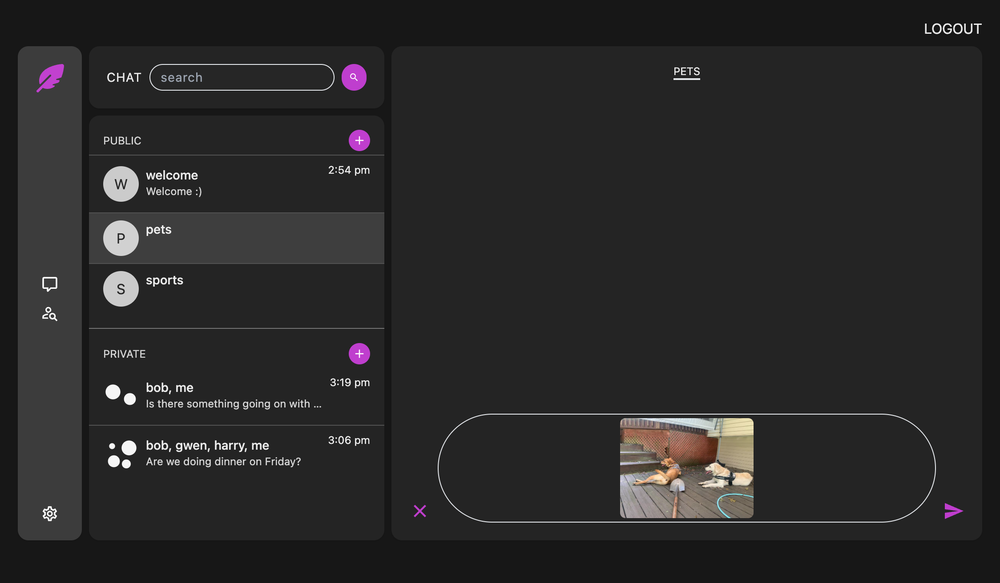

# Chat App

This is an implementation of the [Odin Project's](https://www.theodinproject.com) Messaging App project. It is a fullstack messaging app with a React frontend and Rails backend.

## Features

- Realtime messaging using WebSockets.
- Messages may be text or an image (with Cloudinary for image storage)
- Public and private chats
- Notifications for new messages received in private chats (when user is not in the private chat at the time the message is sent)
- Ability to delete and edit text messages, delete image messages
- Authentication with Devise
- Light and dark modes

### A note about deleting private chats

Requests to delete a private chat won't actually delete the room unless the other user has deleted their account. This way the chat remains visible to the other user like it would be for mobile text messaging. Unlike mobile messaging, however, the "deletor" of a private chat will not receive messages from that room until they restart the conversation on their end (so requests to delete a private chat function essentially like blocking someone). If a user restarts a conversation, the messages they see on their side of the chat are those that are sent on or after the reinstatement.

### And a note about public rooms

Currently public rooms may be renamed by their creators, but they are not deletable. This is to prevent the strangeness of a public chatroom that is still active being deleted. I have not yet decided how to deal with the cleanup of inactive rooms. So for now, inactive rooms are simply not displayed. This is not ideal because rooms have a uniqueness constraint on their names and there will be some unavailable room names that are not obviously unavailable.

#### Screenshots

Welcome component:

Private chat example:

Public chatroom example:

Image Preview: 

People component, with online indicator:

#### Future Improvements

- Better test coverage.
- Add ability to delete inactive public rooms, either through a background job or by giving their creators the option to delete them manually.
- Switch the broadcasting of a new private chat to occur when the first message is sent and not when the room itself is created.

#### Built with

- Ruby on Rails
- React
- Tailwind
